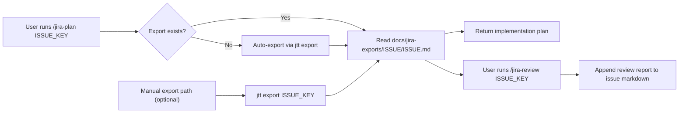

# jira-ticket-tools

<div align="center">

<a href="https://github.com/TannerTitlow/jira-ticket-tools" aria-label="Jira Ticket Tools repository">
  
</a>

[![CI][badge_ci]][url_ci]
[![License: MIT][badge_license]][url_license]
[![Platform][badge_platform]][url_repo]
[![Language][badge_language]][url_repo]

Jira export automation for engineering workflows.

Install one CLI, configure once, and enable `/jira-plan` + `/jira-review` across OpenCode, Claude Code, and Cursor.

<strong>One source of truth for ticket context → planning → review.</strong>

</div>

<div align="center">
  <sub>
    <a href="#why-this-exists">Why this exists</a> •
    <a href="#quick-start">Quick start</a> •
    <a href="#workflow-overview">Workflow overview</a> •
    <a href="#commands-and-behavior">Commands and behavior</a> •
    <a href="#cli-reference">CLI reference</a> •
    <a href="#troubleshooting">Troubleshooting</a> •
    <a href="#ci-and-local-quality-checks">CI and local quality checks</a> •
    <a href="#contributing">Contributing</a> •
    <a href="#license">License</a>
  </sub>
</div>

## Why this exists

> [!TIP]
> If your implementation conversations keep drifting away from Jira acceptance criteria, this repo gives you a repeatable way to keep engineering and ticket intent aligned.

Jira issues usually contain the best implementation context, but that context often gets fragmented across chat, PR comments, and ad hoc notes. `jira-ticket-tools` keeps ticket context in-repo as a durable markdown artifact, so planning and review workflows stay auditable, repeatable, and tool-agnostic.

### At a glance

- Export Jira issues into structured markdown with local asset links.
- Reuse the same artifact across planning and review workflows.
- Keep AI integrations synchronized across OpenCode, Claude Code, and Cursor.
- Validate setup and integrations with doctor + CI smoke checks.

## Quick start

> [!NOTE]
> Need full onboarding by OS? Use `CONTRIBUTING.md`.

### 1) Install the CLI

```bash
pnpm add -g jira-ticket-tools
```

Also works with `npm i -g jira-ticket-tools` or `bun add -g jira-ticket-tools`.

Or run without global install:

```bash
pnpm dlx jira-ticket-tools@latest help
```

### 2) Configure Jira auth + integrate AI tools

```bash
jtt setup
```

or non-interactive:

```bash
jtt setup \
  --jira-base https://your-domain.atlassian.net \
  --jira-email you@company.com \
  --jira-api-token your-token
```

Need a token? Create one in [Atlassian account security](https://id.atlassian.com/manage-profile/security/api-tokens).

### 3) Run commands in your AI tool

```text
/jira-plan PROJ-1234
/jira-review PROJ-1234
```

### 4) Optional manual export

```bash
jtt export PROJ-1234 ./docs/jira-exports/PROJ-1234/PROJ-1234.md
```

> [!TIP]
> You can start with `/jira-plan` even if no markdown export exists yet. The command can create `docs/jira-exports/<ISSUE_KEY>/<ISSUE_KEY>.md` on demand.

## Workflow overview



### Lifecycle

1. Start with `/jira-plan` (typical path).
2. Auto-export happens only when needed.
3. `/jira-review` appends coverage status to the same artifact.
4. Manual export scripts remain available for standalone usage.

## Commands and behavior

### `/jira-plan <ISSUE_KEY>`

- Ensures `docs/jira-exports/<ISSUE_KEY>/<ISSUE_KEY>.md` exists (creates if missing via `jtt export`).
- Extracts scope, acceptance criteria, and constraints from the export.
- Produces a codebase-specific implementation plan.
- If implementation happens in-session, ends with reconciliation: `Implemented`, `Discussed`, `Open`.

### `/jira-review <ISSUE_KEY>`

- Documentation-only workflow.
- Requires an existing issue markdown export.
- Appends `## Review Report (YYYY-MM-DD HH:MM)` to the issue markdown.
- Adds a requirement-level checklist with evidence and follow-up questions.
- Does not modify source code.

## CLI reference

### Setup + integration

```bash
jtt setup --jira-base https://your-domain.atlassian.net --jira-email you@company.com --jira-api-token your-token
jtt integrate
jtt integrate cursor --force
jtt integrate opencode --quiet
```

### Config

```bash
jtt config path
jtt config get JIRA_BASE
jtt config set JIRA_EMAIL you@company.com
jtt config validate
```

### Manual exports

```bash
jtt export PROJ-1234
jtt export PROJ-1234 ./docs/jira-exports/PROJ-1234/PROJ-1234.md
jtt export PROJ-1234 --format json
jtt export PROJ-1234 --format xml
```

### Troubleshooting

```bash
jtt doctor
jtt doctor --provider cursor
jtt troubleshoot --quiet
```

### Uninstall integrations

```bash
jtt uninstall
jtt uninstall cursor
jtt uninstall all --dry-run
jtt uninstall all --remove-config
```

<details>
<summary><strong>Output layout</strong></summary>

```text
docs/
  jira-exports/
    PROJ-1234/
      PROJ-1234.md
      assets/
        image-1.png
        image-2.jpg
```

Keep each issue markdown file and its `assets/` directory together.

</details>

## Troubleshooting

Run health checks:

```bash
jtt doctor
```

Useful variants:

```bash
jtt doctor --provider cursor
jtt doctor --provider opencode --quiet
```

Doctor checks:

- Required tools (`node`, `bash`)
- Jira auth vars (`JIRA_BASE`, `JIRA_EMAIL`, `JIRA_API_TOKEN`)
- Integration files for OpenCode, Claude Code, and Cursor

If your Jira XML endpoint is restricted in your tenant, use markdown export (`jtt export <ISSUE_KEY>`).

## CI and local quality checks

CI runs package checks, shell linting for Cursor helper scripts, and CLI smoke tests.

Run the same checks locally:

```bash
npm run check
npm run lint:shell
npm run smoke
```

## Contributing

See `CONTRIBUTING.md` for OS-specific bootstrap and contributor workflows.

## License

MIT - see `LICENSE`.

[url_repo]: https://github.com/TannerTitlow/jira-ticket-tools
[url_ci]: https://github.com/TannerTitlow/jira-ticket-tools/actions/workflows/ci.yml
[url_license]: ./LICENSE
[badge_ci]: https://github.com/TannerTitlow/jira-ticket-tools/actions/workflows/ci.yml/badge.svg?branch=main
[badge_license]: https://img.shields.io/badge/license-MIT-0b57d0
[badge_platform]: https://img.shields.io/badge/platform-linux%20%7C%20macOS%20%7C%20WSL-111827
[badge_language]: https://img.shields.io/badge/language-node%20%2B%20bash-0f766e
