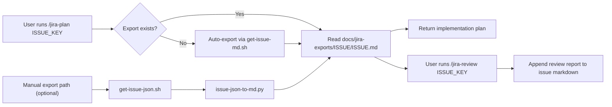

# jira-ticket-tools

<div align="center">

[![CI][badge_ci]][url_ci]
[![License: MIT][badge_license]][url_license]
[![Platform][badge_platform]][url_repo]
[![Language][badge_language]][url_repo]

Jira export automation for engineering workflows.

Turn Jira issues into rich markdown artifacts, then drive reliable AI planning and review workflows across OpenCode, Claude Code, and Cursor.

<strong>One source of truth for ticket context → planning → review.</strong>

</div>

## Table of contents

- [Why this exists](#why-this-exists)
- [Quick start](#quick-start)
- [Workflow overview](#workflow-overview)
- [Commands and behavior](#commands-and-behavior)
- [Install options](#install-options)
- [Script reference](#script-reference)
- [Troubleshooting](#troubleshooting)
- [CI and local quality checks](#ci-and-local-quality-checks)
- [Contributing](#contributing)
- [License](#license)

## Why this exists

> [!TIP]
> If your implementation conversations keep drifting away from Jira acceptance criteria, this repo gives you a repeatable way to keep engineering and ticket intent aligned.

Jira issues usually contain the best implementation context, but that context often gets fragmented across chat, PR comments, and ad hoc notes. `jira-ticket-tools` keeps ticket context in-repo as a durable markdown artifact, so planning and review workflows stay auditable, repeatable, and tool-agnostic.

### At a glance

- Export Jira issues into structured markdown with local asset links.
- Reuse the same artifact across planning and review workflows.
- Keep AI integrations synchronized across OpenCode, Claude Code, and Cursor.
- Validate setup and integrations with doctor + CI smoke checks.

## Quick start

> [!NOTE]
> Need full onboarding by OS? Use `CONTRIBUTING.md`.

### 1) Configure Jira auth

```bash
cp .env.example .env
```

Populate `.env`:

```bash
JIRA_BASE="https://your-domain.atlassian.net"
JIRA_EMAIL="you@company.com"
JIRA_API_TOKEN="your-token"
```

### 2) Export one issue to markdown

```bash
./scripts/get-issue-md.sh PROJ-1234 ./docs/jira-exports/PROJ-1234/PROJ-1234.md
```

### 3) Install AI integrations

```bash
./scripts/install-ai-integrations.sh
```

### 4) Persist tools path (recommended)

```bash
echo 'export JIRA_TICKET_TOOLS_DIR="/absolute/path/to/jira-ticket-tools"' >> ~/.bashrc
source ~/.bashrc
```

If you use zsh, update `~/.zshrc` instead of `~/.bashrc`.

### 5) Run commands in your AI tool

```text
/jira-plan PROJ-1234
/jira-review PROJ-1234
```

> [!TIP]
> You can start with `/jira-plan` even if no markdown export exists yet. The command can create `docs/jira-exports/<ISSUE_KEY>/<ISSUE_KEY>.md` on demand.

## Workflow overview



### Lifecycle

1. Start with `/jira-plan` (typical path).
2. Auto-export happens only when needed.
3. `/jira-review` appends coverage status to the same artifact.
4. Manual export scripts remain available for standalone usage.

## Commands and behavior

### `/jira-plan <ISSUE_KEY>`

- Ensures `docs/jira-exports/<ISSUE_KEY>/<ISSUE_KEY>.md` exists (creates if missing via `get-issue-md.sh`).
- Extracts scope, acceptance criteria, and constraints from the export.
- Produces a codebase-specific implementation plan.
- If implementation happens in-session, ends with reconciliation: `Implemented`, `Discussed`, `Open`.

### `/jira-review <ISSUE_KEY>`

- Documentation-only workflow.
- Requires an existing issue markdown export.
- Appends `## Review Report (YYYY-MM-DD HH:MM)` to the issue markdown.
- Adds a requirement-level checklist with evidence and follow-up questions.
- Does not modify source code.

## Install options

### Unified installer

```bash
./scripts/install-ai-integrations.sh
./scripts/install-ai-integrations.sh --cursor
./scripts/install-ai-integrations.sh --opencode --claude
./scripts/install-ai-integrations.sh --all --force
```

### Direct installers

- `./scripts/install-opencode-integration.sh`
- `./scripts/install-claude-code-integration.sh`
- `./scripts/install-cursor-integration.sh`

All installers support:

- `--force` to reinstall when already present
- `--quiet` for minimal logs
- `--no-color` and `--no-anim` for plain output

## Script reference

| Script | Purpose |
|---|---|
| `scripts/get-issue-md.sh` | Fetch issue JSON and convert to markdown with local assets |
| `scripts/issue-json-to-md.py` | Render Jira ADF to markdown and download image attachments |
| `scripts/get-issue-json.sh` | Fetch raw Jira issue JSON |
| `scripts/get-issue-xml.sh` | Fetch Jira XML issue endpoint |
| `scripts/export-issues-xml-bulk.sh` | Bulk XML export from issue key list |
| `scripts/doctor.sh` | Validate dependencies, env vars, and integration install state |
| `scripts/install-ai-integrations.sh` | Unified installer for OpenCode, Claude Code, and Cursor |

Most shell scripts support `--quiet`, `--no-color`, and `--no-anim`.

<details>
<summary><strong>Output layout</strong></summary>

```text
docs/
  jira-exports/
    PROJ-1234/
      PROJ-1234.md
      assets/
        image-1.png
        image-2.jpg
```

Keep each issue markdown file and its `assets/` directory together.

</details>

## Troubleshooting

> [!IMPORTANT]
> If an integration command cannot find scripts, verify `JIRA_TICKET_TOOLS_DIR` is set and persisted in your shell profile.

Run health checks:

```bash
./scripts/doctor.sh
```

Useful variants:

```bash
./scripts/doctor.sh --provider cursor
./scripts/doctor.sh --provider opencode --quiet
./scripts/doctor.sh --provider cursor --no-color --no-anim
```

Doctor checks:

- Required tools (`bash`, `python3`, `curl`)
- Jira auth vars (`JIRA_BASE`, `JIRA_EMAIL`, `JIRA_API_TOKEN`)
- Integration files for OpenCode, Claude Code, and Cursor

If your Jira XML endpoint is restricted in your tenant, use the JSON-to-markdown flow (`get-issue-md.sh`).

## CI and local quality checks

CI runs shell linting and installer smoke tests on pushes and PRs.

Run the same checks locally:

```bash
bash ./scripts/run-shellcheck.sh
bash ./scripts/ci-checks.sh
```

## Contributing

See `CONTRIBUTING.md` for OS-specific bootstrap and contributor workflows.

## License

MIT - see `LICENSE`.

[url_repo]: https://github.com/TannerTitlow/jira-ticket-tools
[url_ci]: https://github.com/TannerTitlow/jira-ticket-tools/actions/workflows/ci.yml
[url_license]: ./LICENSE
[badge_ci]: https://github.com/TannerTitlow/jira-ticket-tools/actions/workflows/ci.yml/badge.svg?branch=main
[badge_license]: https://img.shields.io/badge/license-MIT-0b57d0
[badge_platform]: https://img.shields.io/badge/platform-linux%20%7C%20macOS%20%7C%20WSL-111827
[badge_language]: https://img.shields.io/badge/language-bash%20%2B%20python3-0f766e
